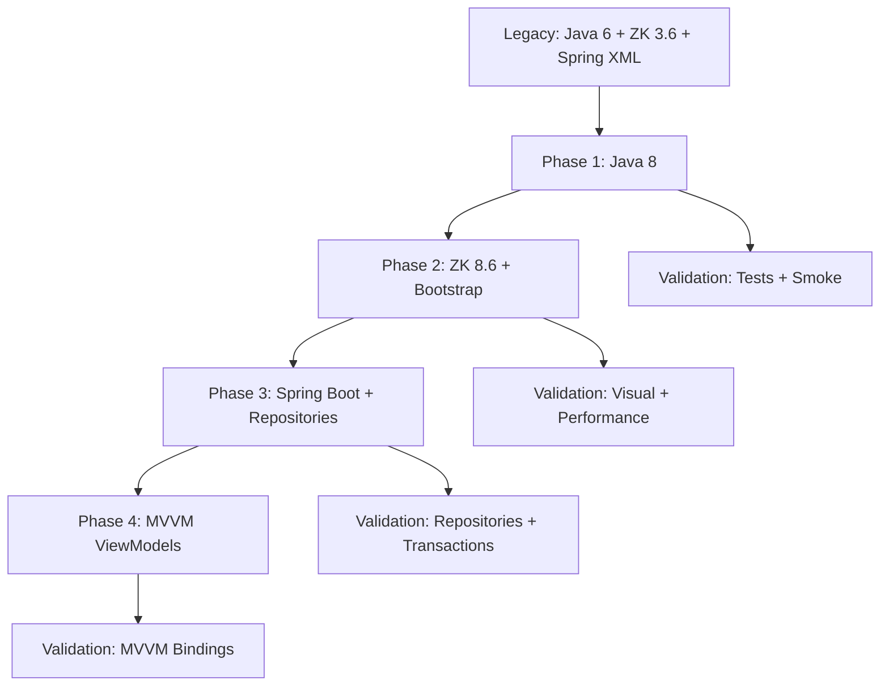

# ZK Framework Legacy Migration

## Overview

Estratégia de migração incremental para aplicações Java legadas com ZK Framework, seguindo abordagem de 4 fases independentes e validáveis. Cada fase entrega valor técnico demonstrável ao time sem quebrar funcionalidades existentes.

## Migration Phases

### Phase 1: Java 8 Baseline
**Branch:** `main`
**Goal:** Atualizar compilação para Java 8 preservando comportamento

**Steps:**
1. Update `pom.xml` compiler properties:
   ```xml
   <maven.compiler.source>1.8</maven.compiler.source>
   <maven.compiler.target>1.8</maven.compiler.target>
   ```

2. Upgrade Maven plugins incompatíveis:
   - `maven-compiler-plugin`: mínimo 2.5.1
   - `maven-war-plugin`: mínimo 3.3.2 (evita incompatibilidade com Java modular)

3. Resolver incompatibilidades de API legadas (se houver)

4. **Validation:**
   - `mvn clean test` → BUILD SUCCESS
   - Smoke test: login, menu, CRUDs principais
   - Zero regressão funcional

### Phase 2: ZK 8 + Bootstrap UI
**Branch:** `feature/zk8-bootstrap-ui`
**Goal:** Modernizar frontend visual mantendo MVC

**Steps:**
1. Upgrade ZK Framework dependencies:
   ```xml
   <zk.version>8.6.0.1</zk.version>
   ```

2. Add Bootstrap theme:
   ```xml
   <dependency>
       <groupId>org.zkoss.theme</groupId>
       <artifactId>iceblue_c</artifactId>
       <version>${zk.version}</version>
   </dependency>
   ```

3. Configure `zk.xml`:
   ```xml
   <library-property>
       <name>org.zkoss.theme.preferred</name>
       <value>iceblue_c</value>
   </library-property>
   <library-property>
       <name>org.zkoss.zul.grid.autofitWidth</name>
       <value>true</value>
   </library-property>
   ```

4. Update `.zul` files:
   - Add responsive properties: `vflex="1"`, `hflex="min"`
   - Verify event handlers compatibility (ZK 8 API changes)

5. Update Servlet API to 3.1+:
   ```xml
   <dependency>
       <groupId>javax.servlet</groupId>
       <artifactId>javax.servlet-api</artifactId>
       <version>3.1.0</version>
       <scope>provided</scope>
   </dependency>
   ```

6. **Validation:**
   - Visual regression: compare screenshots
   - Performance: equivalente ou melhor
   - Responsiveness: teste em desktop + mobile

### Phase 3: Spring Boot Modernization
**Branch:** `feature/springboot-modernization`
**Goal:** Migrar para Spring Boot e eliminar DAOs legados

**Steps:**
1. Migrar DAOs para Spring Data Repositories:
   ```java
   public interface AlunoRepository extends JpaRepository<Aluno, Long> {
       List<Aluno> findByNomeContaining(String nome);
   }
   ```

2. Atualizar Spring Context XML para beans corretos:
   ```xml
   <bean id="alunoService" class="br.gov.inep.censo.service.AlunoService">
       <constructor-arg ref="layoutCampoValueRepository"/>
       <constructor-arg ref="alunoRepository"/>
       <constructor-arg ref="opcaoVinculoRepository"/>
       <constructor-arg ref="transactionManager"/>
       <constructor-arg ref="entityManagerFactory"/>
   </bean>
   ```

3. Configurar Spring Data JPA:
   ```xml
   <jpa:repositories base-package="br.gov.inep.censo.repository"
                      entity-manager-factory-ref="entityManagerFactory"
                      transaction-manager-ref="transactionManager"/>
   ```

4. Remover DAOs legados após validação de Repositories

5. **Validation:**
   - Testes de integração passando
   - CRUDs funcionando sem camada DAO customizada
   - Transações e queries funcionais

### Phase 4: MVVM Final Pattern
**Branch:** `feature/zk-mvvm-final`
**Goal:** Migrar de MVC Composer para MVVM ViewModels

**Steps:**
1. Create ViewModel replacing Composer:
   ```java
   public class AlunoViewModel {
       @Command
       @NotifyChange("alunos")
       public void salvar() {
           alunoService.salvar(alunoSelecionado);
           // Auto-notify UI changes
       }
   }
   ```

2. Update `.zul` with MVVM bindings:
   ```xml
   <window apply="org.zkoss.bind.BindComposer"
           viewModel="@id('vm') @init('br.gov.inep.censo.vm.AlunoViewModel')">
       <listbox model="@load(vm.alunos)" selectedItem="@bind(vm.alunoSelecionado)">
   ```

3. Migrate module by module (Aluno → Curso → CursoAluno → Docente → IES)

4. **Validation:**
   - Feature parity with Phase 3
   - Reduced UI/business logic coupling
   - Team able to create new screens in MVVM

## Stack Compatibility Matrix

| Component | Legacy | Target | Notes |
|-----------|--------|--------|-------|
| Java | 6/7 | 8 | Lambda support, Stream API |
| ZK Framework | 3.6.2 | 8.6.0.1 | Event model changes, Bootstrap themes |
| Spring | 4.3.x XML | 4.3.x Boot-ready | Prepare for Boot in Phase 3 |
| Hibernate | 4.2.21.Final | 4.2.21.Final | Mantém compatibilidade Java 8 |
| Spring Data JPA | - | 1.11.23.RELEASE | Query methods automáticos |
| Spring Security | 4.2.13.RELEASE | 4.2.13.RELEASE | Compatível com Spring 4.3 |
| Servlet API | 2.5 | 3.1.0 | Requerido por ZK 8 |

## Common Pitfalls

### 1. Spring Context Bean Configuration After DAO Removal
**Problem:** `applicationContext.xml` references deleted DAO classes

**Solution:** Update bean constructors to match Service signatures:
```xml
<!-- WRONG - DAOs deleted -->
<bean id="alunoService">
    <constructor-arg><bean class="br.gov.inep.censo.dao.AlunoDAO"/></constructor-arg>
</bean>

<!-- CORRECT - Use Repositories -->
<bean id="alunoService">
    <constructor-arg ref="layoutCampoValueRepository"/>
    <constructor-arg ref="alunoRepository"/>
    <constructor-arg ref="opcaoVinculoRepository"/>
    <constructor-arg ref="transactionManager"/>
    <constructor-arg ref="entityManagerFactory"/>
</bean>
```

### 2. Maven War Plugin Java Compatibility
**Problem:** `maven-war-plugin:2.6` fails with Java 8+: "module java.base does not opens java.util"

**Solution:** Upgrade to 3.3.2+:
```xml
<maven.war.plugin.version>3.3.2</maven.war.plugin.version>
```

### 3. ZK 8 Event Handler Changes
**Problem:** Event methods changed signatures in ZK 8

**Solution:** Verify Composer event handlers:
```java
// ZK 3.x
public void onClick$btnSalvar(Event event) { }

// ZK 8.x (still compatible)
public void onClick$btnSalvar(Event event) { }
```

### 4. Test Strategy During DAO→Repository Migration
**Problem:** Integration tests fail without Spring Context

**Solution:** Mark integration tests as `@Ignore` temporarily:
```java
@Test
@Ignore("Requires Spring Context (UsuarioRepository)")
public void shouldAuthenticateUser() { }
```
Restore in Phase 3 with Spring Boot Context.

## Quality Gates

### Per-Phase Checklist
- [ ] `mvn clean test` → BUILD SUCCESS
- [ ] JaCoCo coverage meets threshold (5% transitional, 80% final)
- [ ] Smoke test: login → menu → CRUD → logout
- [ ] No functional regression
- [ ] Update `docs/MIGRATION-CHANGELOG.md`
- [ ] Update `.context/` if architectural decision made

### Phase-Specific Gates
**Phase 1:**
- [ ] Java 8 compilation successful
- [ ] All existing tests passing

**Phase 2:**
- [ ] ZK 8 visual themes applied
- [ ] Responsive design validated
- [ ] No ZK API errors in browser console

**Phase 3:**
- [ ] Spring Data Repositories working
- [ ] No DAO dependencies in Services
- [ ] Transaction management functional

**Phase 4:**
- [ ] MVVM bindings working (`@Command`, `@NotifyChange`)
- [ ] Reduced Composer complexity
- [ ] Team trained on MVVM pattern

## Migration Workflow



## Examples

### Example 1: Phase 1 - Java 8 Upgrade

**Before:**
```xml
<maven.compiler.source>1.6</maven.compiler.source>
<maven.compiler.target>1.6</maven.compiler.target>
```

**After:**
```xml
<maven.compiler.source>1.8</maven.compiler.source>
<maven.compiler.target>1.8</maven.compiler.target>
```

**Validation:**
```bash
mvn clean test
# Expected: BUILD SUCCESS, all tests passing
```

### Example 2: Phase 2 - ZK 8 + Bootstrap

**Before (ZK 3.6):**
```xml
<zk.version>3.6.2</zk.version>
<window border="normal" width="900px">
```

**After (ZK 8.6):**
```xml
<zk.version>8.6.0.1</zk.version>
<dependency>
    <groupId>org.zkoss.theme</groupId>
    <artifactId>iceblue_c</artifactId>
</dependency>
```

```xml
<window border="normal" width="900px" hflex="min" vflex="min">
```

### Example 3: Phase 3 - DAO → Repository

**Before (DAO):**
```java
public class AlunoDAO extends AbstractJpaDao<Aluno> {
    public List<Aluno> findByNome(String nome) {
        return entityManager.createQuery(
            "SELECT a FROM Aluno a WHERE a.nome LIKE :nome")
            .setParameter("nome", "%" + nome + "%")
            .getResultList();
    }
}
```

**After (Spring Data):**
```java
public interface AlunoRepository extends JpaRepository<Aluno, Long> {
    List<Aluno> findByNomeContaining(String nome);
}
```

**Spring XML Configuration:**
```xml
<jpa:repositories base-package="br.gov.inep.censo.repository"/>

<bean id="alunoService">
    <constructor-arg ref="alunoRepository"/>
    <!-- other dependencies -->
</bean>
```

## Risk Mitigation

| Risk | Impact | Mitigation |
|------|--------|------------|
| ZK 8 breaks old components | Medium-High | Migrate module by module, smoke test each |
| Spring Boot changes startup lifecycle | High | Homologate context incrementally, keep XML fallback |
| Repository queries differ from DAO | Medium | Integration tests before removing DAO |
| MVVM increases UI rework | Medium | Migrate module by module, fixed visual contract |

## References

- [ZK Framework 8 Migration Guide](https://www.zkoss.org/wiki/ZK_Developer's_Reference/Upgrade_Notes/Upgrade_to_8.0)
- [Spring Data JPA Reference](https://docs.spring.io/spring-data/jpa/docs/1.11.x/reference/html/)
- [Spring Framework 4.3 Documentation](https://docs.spring.io/spring-framework/docs/4.3.x/spring-framework-reference/html/)
- [Hibernate 4.2 Documentation](https://docs.jboss.org/hibernate/orm/4.2/manual/en-US/html/)
- Source: `pom.xml`, `docs/MIGRATION-ROADMAP.md`, `docs/ARCHITECTURE.md` (this project)

## Anti-Patterns to Avoid

1. **Big Bang Migration:** Changing Java + ZK + Spring + MVVM simultaneously
   - ✅ **Instead:** One architectural change per phase

2. **Skipping Tests:** Removing tests during DAO→Repository migration
   - ✅ **Instead:** Mark as `@Ignore`, restore in Phase 3

3. **Mixing Business Logic Changes:** Refactoring business rules during framework upgrade
   - ✅ **Instead:** Separate framework changes from feature changes

4. **Ignoring Web.xml:** Leaving Servlet 2.5 when ZK 8 needs 3.1+
   - ✅ **Instead:** Update to Servlet 3.1 schema in Phase 2

## Success Criteria

✅ Phase completed when:
- Build is green (`mvn clean test`)
- All smoke tests pass
- Documentation updated
- Team demo successful
- Rollback path clear (git branch)
